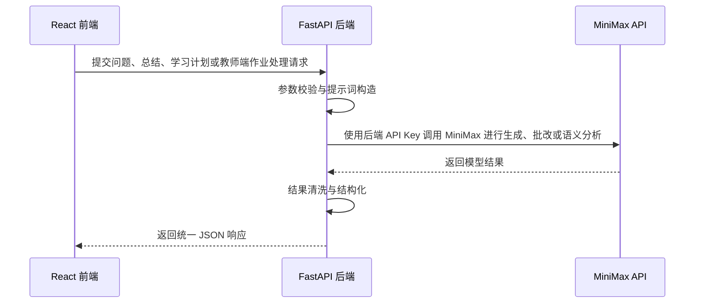

# 智学伴侣 API 文档

## 1. API 概述

本文档描述智学伴侣后端 API 设计。后端使用 Python FastAPI 实现，前端 React 通过 HTTP JSON 接口访问后端服务，后端再根据业务需要访问数据库和 MiniMax 大模型 API。

基础路径：

```text
/api
```

默认响应格式：

```json
{
  "success": true,
  "data": {},
  "message": "ok"
}
```

默认错误响应格式：

```json
{
  "success": false,
  "error": {
    "code": "BAD_REQUEST",
    "message": "请求参数不合法"
  }
}
```

## 2. 通用约定

### 2.1 HTTP 状态码

| 状态码 | 说明 |
| --- | --- |
| 200 | 请求成功 |
| 201 | 创建成功 |
| 400 | 请求参数错误 |
| 404 | 资源不存在 |
| 422 | 参数校验失败 |
| 500 | 服务内部错误 |
| 502 | 大模型服务调用失败 |

### 2.2 时间格式

所有时间字段统一使用 ISO 8601 格式。

```text
2026-06-01T20:00:00+08:00
```

### 2.3 优先级枚举

```text
low
medium
high
```

### 2.4 任务状态枚举

```text
pending
done
```

## 3. 智能问答 API

### 3.1 发送问题

接口：

```http
POST /api/chat
```

功能说明：

向 AI 学习伴侣发送一个学习问题，由后端调用 MiniMax 进行生成、批改或语义分析 生成回答。

请求体：

```json
{
  "question": "请帮我解释一下操作系统中的进程和线程有什么区别？",
  "course": "操作系统",
  "session_id": "session_001"
}
```

字段说明：

| 字段 | 类型 | 必填 | 说明 |
| --- | --- | --- | --- |
| question | string | 是 | 用户问题 |
| course | string | 否 | 课程名称或知识领域 |
| session_id | string | 否 | 会话 ID，不传则后端创建新会话 |

响应示例：

```json
{
  "success": true,
  "data": {
    "session_id": "session_001",
    "answer": "进程是资源分配的基本单位，线程是 CPU 调度的基本单位...",
    "suggestions": [
      "可以结合进程地址空间理解二者区别",
      "建议复习线程共享资源与独立栈空间"
    ]
  },
  "message": "ok"
}
```

### 3.2 获取会话历史

接口：

```http
GET /api/chat/sessions/{session_id}/messages
```

功能说明：

获取指定会话的历史消息。

路径参数：

| 参数 | 类型 | 必填 | 说明 |
| --- | --- | --- | --- |
| session_id | string | 是 | 会话 ID |

响应示例：

```json
{
  "success": true,
  "data": {
    "session_id": "session_001",
    "messages": [
      {
        "id": "msg_001",
        "role": "user",
        "content": "什么是进程？",
        "created_at": "2026-06-01T20:00:00+08:00"
      },
      {
        "id": "msg_002",
        "role": "assistant",
        "content": "进程是程序的一次执行过程...",
        "created_at": "2026-06-01T20:00:02+08:00"
      }
    ]
  },
  "message": "ok"
}
```

## 4. 作业提醒 API

### 4.1 创建作业提醒

接口：

```http
POST /api/tasks
```

功能说明：

创建一条作业或学习任务提醒。

请求体：

```json
{
  "title": "完成高等数学第 3 章习题",
  "course": "高等数学",
  "description": "完成课后 1-10 题，重点复习导数应用。",
  "due_at": "2026-06-05T23:59:00+08:00",
  "priority": "high"
}
```

响应示例：

```json
{
  "success": true,
  "data": {
    "id": "task_001",
    "title": "完成高等数学第 3 章习题",
    "course": "高等数学",
    "description": "完成课后 1-10 题，重点复习导数应用。",
    "due_at": "2026-06-05T23:59:00+08:00",
    "priority": "high",
    "status": "pending",
    "created_at": "2026-06-01T20:00:00+08:00",
    "updated_at": "2026-06-01T20:00:00+08:00"
  },
  "message": "created"
}
```

### 4.2 获取任务列表

接口：

```http
GET /api/tasks
```

功能说明：

查询作业提醒列表。

查询参数：

| 参数 | 类型 | 必填 | 说明 |
| --- | --- | --- | --- |
| status | string | 否 | pending 或 done |
| course | string | 否 | 按课程筛选 |
| priority | string | 否 | low、medium、high |
| due_before | string | 否 | 查询指定时间前截止的任务 |

请求示例：

```http
GET /api/tasks?status=pending&priority=high
```

响应示例：

```json
{
  "success": true,
  "data": {
    "items": [
      {
        "id": "task_001",
        "title": "完成高等数学第 3 章习题",
        "course": "高等数学",
        "due_at": "2026-06-05T23:59:00+08:00",
        "priority": "high",
        "status": "pending"
      }
    ],
    "total": 1
  },
  "message": "ok"
}
```

### 4.3 获取任务详情

接口：

```http
GET /api/tasks/{task_id}
```

响应示例：

```json
{
  "success": true,
  "data": {
    "id": "task_001",
    "title": "完成高等数学第 3 章习题",
    "course": "高等数学",
    "description": "完成课后 1-10 题，重点复习导数应用。",
    "due_at": "2026-06-05T23:59:00+08:00",
    "priority": "high",
    "status": "pending",
    "created_at": "2026-06-01T20:00:00+08:00",
    "updated_at": "2026-06-01T20:00:00+08:00"
  },
  "message": "ok"
}
```

### 4.4 更新任务

接口：

```http
PATCH /api/tasks/{task_id}
```

请求体：

```json
{
  "title": "完成高等数学第 3 章全部习题",
  "priority": "medium",
  "status": "pending"
}
```

响应示例：

```json
{
  "success": true,
  "data": {
    "id": "task_001",
    "title": "完成高等数学第 3 章全部习题",
    "course": "高等数学",
    "description": "完成课后 1-10 题，重点复习导数应用。",
    "due_at": "2026-06-05T23:59:00+08:00",
    "priority": "medium",
    "status": "pending",
    "updated_at": "2026-06-01T21:00:00+08:00"
  },
  "message": "updated"
}
```

### 4.5 标记任务完成

接口：

```http
POST /api/tasks/{task_id}/complete
```

响应示例：

```json
{
  "success": true,
  "data": {
    "id": "task_001",
    "status": "done"
  },
  "message": "completed"
}
```

### 4.6 删除任务

接口：

```http
DELETE /api/tasks/{task_id}
```

响应示例：

```json
{
  "success": true,
  "data": {
    "id": "task_001"
  },
  "message": "deleted"
}
```

## 5. 知识点总结 API

### 5.1 创建知识点总结

接口：

```http
POST /api/summaries
```

功能说明：

提交笔记、课堂内容或知识主题，由后端调用 MiniMax 进行生成、批改或语义分析 生成结构化总结。

请求体：

```json
{
  "title": "操作系统进程管理",
  "course": "操作系统",
  "source_text": "进程是程序的一次执行过程，包含程序段、数据段和进程控制块...",
  "summary_type": "structured"
}
```

字段说明：

| 字段 | 类型 | 必填 | 说明 |
| --- | --- | --- | --- |
| title | string | 是 | 总结标题 |
| course | string | 否 | 所属课程 |
| source_text | string | 是 | 待总结内容 |
| summary_type | string | 否 | structured、brief、review |

响应示例：

```json
{
  "success": true,
  "data": {
    "id": "summary_001",
    "title": "操作系统进程管理",
    "course": "操作系统",
    "summary": {
      "overview": "本部分主要介绍进程的定义、状态转换和调度机制。",
      "key_points": [
        "进程是资源分配的基本单位",
        "进程状态通常包括就绪、运行和阻塞",
        "调度算法影响系统响应时间和吞吐量"
      ],
      "difficult_points": [
        "进程与线程的区别",
        "阻塞和就绪状态的转换条件"
      ],
      "review_tips": [
        "结合状态转换图记忆进程生命周期",
        "对比 FCFS、SJF、时间片轮转等调度算法"
      ]
    },
    "created_at": "2026-06-01T20:00:00+08:00"
  },
  "message": "created"
}
```

### 5.2 获取总结列表

接口：

```http
GET /api/summaries
```

查询参数：

| 参数 | 类型 | 必填 | 说明 |
| --- | --- | --- | --- |
| course | string | 否 | 按课程筛选 |
| keyword | string | 否 | 按标题或内容关键词搜索 |

响应示例：

```json
{
  "success": true,
  "data": {
    "items": [
      {
        "id": "summary_001",
        "title": "操作系统进程管理",
        "course": "操作系统",
        "created_at": "2026-06-01T20:00:00+08:00"
      }
    ],
    "total": 1
  },
  "message": "ok"
}
```

### 5.3 获取总结详情

接口：

```http
GET /api/summaries/{summary_id}
```

响应示例：

```json
{
  "success": true,
  "data": {
    "id": "summary_001",
    "title": "操作系统进程管理",
    "course": "操作系统",
    "source_text": "进程是程序的一次执行过程...",
    "summary": {
      "overview": "本部分主要介绍进程的定义、状态转换和调度机制。",
      "key_points": ["进程是资源分配的基本单位"],
      "difficult_points": ["进程与线程的区别"],
      "review_tips": ["结合状态转换图记忆进程生命周期"]
    },
    "created_at": "2026-06-01T20:00:00+08:00"
  },
  "message": "ok"
}
```

### 5.4 删除总结

接口：

```http
DELETE /api/summaries/{summary_id}
```

响应示例：

```json
{
  "success": true,
  "data": {
    "id": "summary_001"
  },
  "message": "deleted"
}
```

## 6. 学生端个性化学习计划 API

### 6.1 生成个性化学习计划

接口：

```http
POST /api/student/learning-plans
```

功能说明：

根据学生成绩、作业完成情况、薄弱知识点和学习目标，调用 MiniMax 进行生成、批改或语义分析 生成定制化学习计划。

请求体：

```json
{
  "student_id": "student_001",
  "course": "高等数学",
  "goal": "两周内提升导数应用题正确率",
  "grade_records": [
    {
      "exam_name": "期中考试",
      "score": 72,
      "full_score": 100
    }
  ],
  "homework_records": [
    {
      "title": "第 3 章导数作业",
      "score": 68,
      "full_score": 100,
      "weak_points": ["复合函数求导", "极值应用题"]
    }
  ],
  "available_time_per_day": 60
}
```

响应示例：

```json
{
  "success": true,
  "data": {
    "id": "plan_001",
    "student_id": "student_001",
    "course": "高等数学",
    "analysis": {
      "current_level": "基础概念掌握一般，应用题偏弱",
      "weak_points": ["复合函数求导", "极值应用题"],
      "priority": "先补齐求导规则，再训练应用题建模"
    },
    "plan": [
      {
        "day": 1,
        "task": "复习复合函数求导规则并完成 10 道基础题",
        "duration_minutes": 60
      },
      {
        "day": 2,
        "task": "整理极值应用题常见模型并完成 5 道例题",
        "duration_minutes": 60
      }
    ],
    "created_at": "2026-06-01T20:00:00+08:00"
  },
  "message": "created"
}
```

### 6.2 获取学生学习计划列表

接口：

```http
GET /api/student/learning-plans
```

查询参数：

| 参数 | 类型 | 必填 | 说明 |
| --- | --- | --- | --- |
| student_id | string | 是 | 学生 ID |
| course | string | 否 | 课程名称 |
| status | string | 否 | active、completed 或 archived |

响应示例：

```json
{
  "success": true,
  "data": {
    "items": [
      {
        "id": "plan_001",
        "course": "高等数学",
        "status": "active",
        "created_at": "2026-06-01T20:00:00+08:00"
      }
    ],
    "total": 1
  },
  "message": "ok"
}
```

## 7. 教师端 AI 作业处理 API

### 7.1 AI 批改作业

接口：

```http
POST /api/teacher/assignments/{assignment_id}/grade
```

功能说明：

教师提交作业 ID、参考答案和评分标准，系统调用 MiniMax 对学生提交进行 AI 批改，生成分数、评语、扣分点和修改建议。

请求体：

```json
{
  "submission_ids": ["submission_001", "submission_002"],
  "reference_answer": "参考答案内容...",
  "rubric": "满分 100 分，概念解释 30 分，过程分析 40 分，结论 30 分。",
  "need_teacher_confirm": true
}
```

响应示例：

```json
{
  "success": true,
  "data": {
    "assignment_id": "assignment_001",
    "results": [
      {
        "submission_id": "submission_001",
        "student_id": "student_001",
        "ai_score": 86,
        "comments": "整体思路正确，但关键概念解释不够完整。",
        "deductions": [
          {
            "point": "进程状态转换条件说明不完整",
            "minus": 6
          }
        ],
        "suggestions": ["补充阻塞态与就绪态的转换条件", "增加调度算法对比"]
      }
    ]
  },
  "message": "graded"
}
```

### 7.2 AI 查重

接口：

```http
POST /api/teacher/assignments/{assignment_id}/plagiarism-check
```

功能说明：

对指定作业的多份提交进行查重，结合文本相似度和 MiniMax 语义分析识别高度相似内容。

请求体：

```json
{
  "submission_ids": ["submission_001", "submission_002", "submission_003"],
  "threshold": 0.8
}
```

响应示例：

```json
{
  "success": true,
  "data": {
    "assignment_id": "assignment_001",
    "suspicious_pairs": [
      {
        "submission_a": "submission_001",
        "submission_b": "submission_002",
        "similarity": 0.87,
        "risk_level": "high",
        "similar_segments": ["对进程定义的表述高度一致", "结论段落结构相同"],
        "ai_reason": "两份作业在观点顺序、关键句表达和例子选择上高度相似，存在参考同一来源的可能。"
      }
    ]
  },
  "message": "checked"
}
```

### 7.3 作业比对

接口：

```http
POST /api/teacher/assignments/{assignment_id}/compare
```

功能说明：

对两份或多份作业进行 AI 比对，输出结构差异、观点差异、共同问题和改进建议。

请求体：

```json
{
  "submission_ids": ["submission_001", "submission_002"],
  "compare_dimensions": ["structure", "concept", "expression", "conclusion"]
}
```

响应示例：

```json
{
  "success": true,
  "data": {
    "assignment_id": "assignment_001",
    "comparison": {
      "common_points": ["都能说明进程是程序执行过程"],
      "differences": ["submission_001 对线程区别解释更完整", "submission_002 缺少调度相关内容"],
      "common_issues": ["都没有结合具体场景举例"],
      "teacher_suggestions": ["课堂上补充进程状态转换案例", "强调概念解释和例子结合"]
    }
  },
  "message": "compared"
}
```

### 7.4 获取 AI 批改报告

接口：

```http
GET /api/teacher/assignments/{assignment_id}/grading-report
```

响应示例：

```json
{
  "success": true,
  "data": {
    "assignment_id": "assignment_001",
    "average_score": 82.5,
    "common_mistakes": ["概念解释不完整", "缺少案例分析"],
    "weak_points": ["进程状态转换", "线程共享资源"],
    "teaching_suggestions": ["建议下一节课用流程图讲解状态转换", "安排一次概念对比小测"]
  },
  "message": "ok"
}
```

## 8. 健康检查 API

接口：

```http
GET /api/health
```

功能说明：

用于检查后端服务是否正常运行。

响应示例：

```json
{
  "success": true,
  "data": {
    "status": "ok",
    "service": "zhixue-companion-api"
  },
  "message": "ok"
}
```

## 9. MiniMax 调用边界

前端不直接调用 MiniMax 进行生成、批改或语义分析。所有大模型请求统一由后端处理。



## 10. 后端路由规划

| 模块 | 路由前缀 | 文件建议 |
| --- | --- | --- |
| 健康检查 | /api/health | app/main.py |
| 智能问答 | /api/chat | app/api/routes_chat.py |
| 作业提醒 | /api/tasks | app/api/routes_tasks.py |
| 知识总结 | /api/summaries | app/api/routes_summary.py |
| 学生端个性化学习计划 | /api/student/learning-plans | app/api/routes_learning_plans.py |
| 教师端 AI 作业处理 | /api/teacher/assignments | app/api/routes_teacher_assignments.py |

## 11. 前端接口封装建议

前端建议将 API 调用集中放在 `src/api` 目录中。

```ts
export async function sendChatMessage(payload: {
  question: string;
  course?: string;
  session_id?: string;
}) {
  const response = await fetch('/api/chat', {
    method: 'POST',
    headers: { 'Content-Type': 'application/json' },
    body: JSON.stringify(payload),
  });
  return response.json();
}
```
