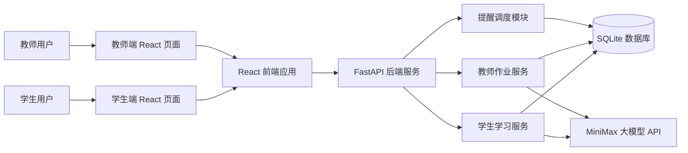
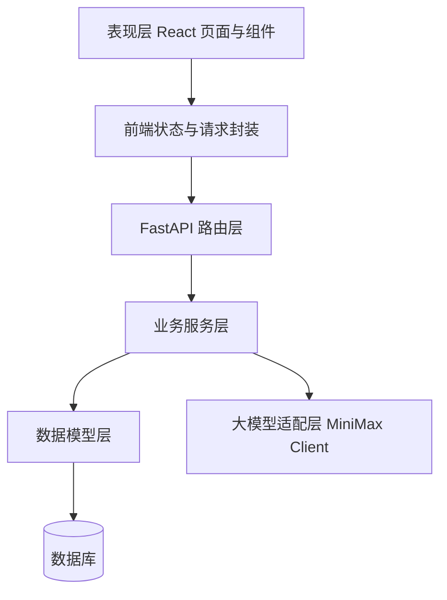
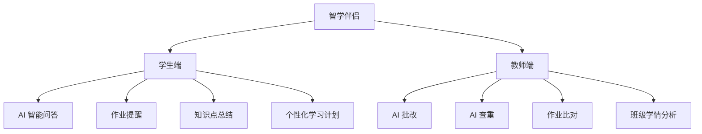
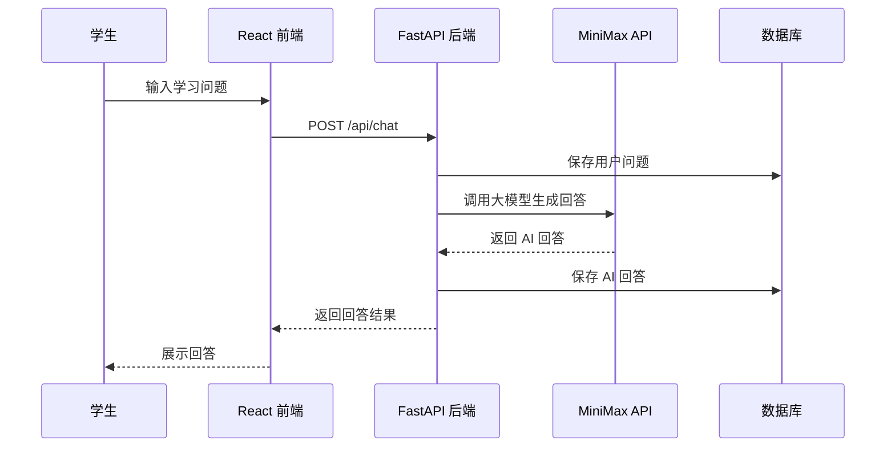
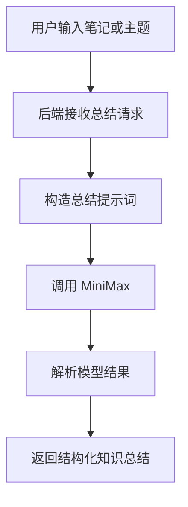
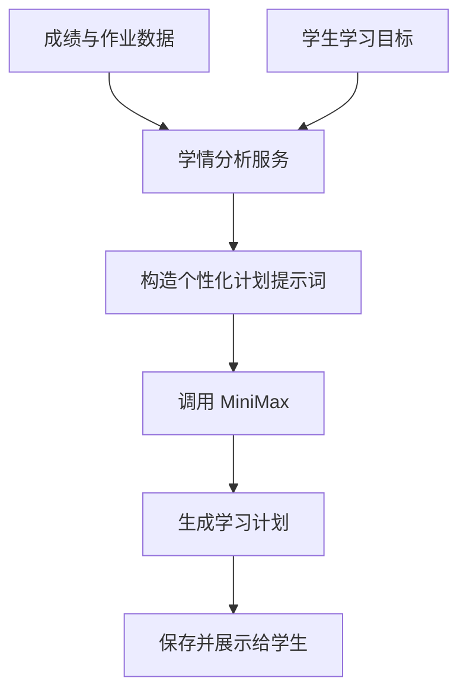
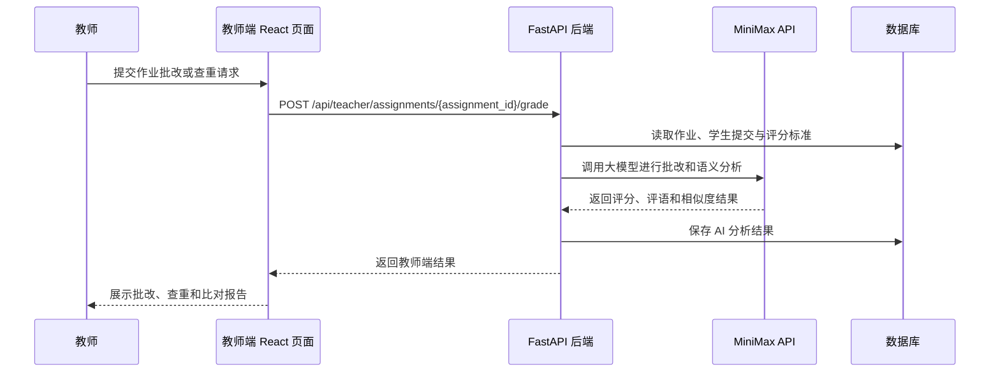

# 智学伴侣架构设计文档

## 1. 项目概述

智学伴侣是一个基于 AI 的校园学习伴侣系统，项目分为学生端和教师端。学生端面向日常学习场景，提供智能问答、作业提醒、知识点总结和个性化学习计划；教师端面向作业管理场景，提供 AI 批改、查重和作业比对能力。项目定位不是传统教学平台，而是突出 AI 在学习陪伴、学情分析和作业辅助处理中的作用。

## 2. 建设目标

- 提供学生端 AI 问答能力，支持课程知识、学习方法、作业要求等问题咨询。
- 提供学生端作业提醒与知识点总结能力，帮助学生管理学习任务并沉淀复习材料。
- 提供学生端个性化学习计划能力，根据成绩、作业完成情况、错题薄弱点生成定制化学习安排。
- 提供教师端 AI 批改能力，对学生作业给出评分、评语、扣分点和修改建议。
- 提供教师端 AI 查重和作业比对能力，辅助识别高度相似内容、参考痕迹和异常提交。
- 提供分角色前端交互界面，学生端突出陪伴式学习，教师端突出效率提升和学情洞察。
- 后端采用 FastAPI 构建 API 服务，使用 uv 管理 Python 项目依赖。
- 大模型能力接入 MiniMax，用于问答、总结、学习计划生成、作业批改和语义相似度分析。

## 3. 技术选型

- 前端：React、TypeScript、Vite、React Router、Axios 或 Fetch API。
- 后端：Python、FastAPI、uv、Pydantic、Uvicorn。
- 大模型：MiniMax API。
- 数据存储：SQLite 作为课程设计阶段的轻量数据库，后续可替换为 PostgreSQL 或 MySQL。
- 鉴权方案：课程设计阶段可采用简单 Token 或用户 ID 模拟，后续可扩展 JWT。
- 部署方式：前端静态资源部署，后端独立运行 API 服务。

## 4. 总体架构



## 5. 分层架构



## 6. 功能模块设计

### 6.1 端侧划分

系统按照使用角色分为学生端和教师端。学生端强调 AI 学习陪伴，教师端强调 AI 辅助处理作业和提升教学管理效率。



### 6.2 学生端智能问答模块

智能问答模块用于接收学生提出的问题，并调用 MiniMax 大模型生成回答。系统可以记录问答历史，方便用户回顾。

主要能力：

- 支持自然语言提问。
- 支持指定课程或知识领域。
- 支持返回简洁回答、详细解释和学习建议。
- 支持保存历史会话。

处理流程：



### 6.3 学生端作业提醒模块

作业提醒模块用于记录学习任务和作业截止时间。用户可以新增、查看、更新、完成或删除提醒。

主要能力：

- 新增作业提醒。
- 设置课程名称、截止时间、优先级和备注。
- 标记任务完成状态。
- 查询待完成任务和即将截止任务。

### 6.4 学生端知识点总结模块

知识点总结模块用于将用户输入的课堂笔记、教材片段或主题内容整理为结构化摘要。

主要能力：

- 生成知识点概要。
- 提炼重点、难点和易错点。
- 生成复习清单。
- 可选生成练习建议。

处理流程：



### 6.5 学生端个性化学习计划模块

个性化学习计划模块根据学生的成绩、作业完成情况、错题记录和学习目标，调用 MiniMax 生成定制化学习安排。该模块突出 AI 对学情的分析能力，不只是展示数据，而是主动给出可执行的学习路径。

主要能力：

- 分析学生近期成绩、作业得分、逾期情况和薄弱知识点。
- 生成按天或按周安排的学习计划。
- 推荐复习重点、练习方向和时间分配。
- 根据后续作业表现动态调整计划。

处理流程：



### 6.6 教师端 AI 作业处理模块

教师端 AI 作业处理模块用于辅助教师批量处理学生作业。系统通过 MiniMax 对文本类作业进行评分、评语生成、查重判断和多份作业之间的语义比对，帮助教师提升批改效率。

主要能力：

- AI 批改：根据题目、参考答案和评分标准生成分数、评语、扣分点和修改建议。
- AI 查重：检测学生作业与历史提交、同班提交之间的语义相似度和可疑片段。
- 作业比对：对两份或多份作业进行结构、观点、表达方式和关键结论比对。
- 班级学情：汇总常见错误、平均得分、薄弱知识点，为教师提供教学调整建议。

处理流程：



## 7. 后端目录建议

```text
backend/
  pyproject.toml
  uv.lock
  app/
    main.py
    core/
      config.py
    api/
      routes_chat.py
      routes_tasks.py
      routes_summary.py
      routes_learning_plans.py
      routes_teacher_assignments.py
    services/
      chat_service.py
      task_service.py
      summary_service.py
      learning_plan_service.py
      grading_service.py
      plagiarism_service.py
      assignment_compare_service.py
      minimax_client.py
    models/
      task.py
      chat.py
      assignment.py
      submission.py
      grade.py
      learning_plan.py
    schemas/
      chat.py
      task.py
      summary.py
      learning_plan.py
      teacher_assignment.py
    db/
      session.py
      init_db.py
```

## 8. 前端目录建议

```text
frontend/
  package.json
  vite.config.ts
  src/
    main.tsx
    App.tsx
    api/
      client.ts
      chat.ts
      tasks.ts
      summary.ts
    pages/
      StudentChatPage.tsx
      StudentTaskPage.tsx
      StudentSummaryPage.tsx
      StudentLearningPlanPage.tsx
      TeacherAssignmentPage.tsx
      TeacherGradingPage.tsx
      TeacherComparePage.tsx
    components/
      Layout.tsx
      StudentLayout.tsx
      TeacherLayout.tsx
      ChatBox.tsx
      TaskCard.tsx
      SummaryPanel.tsx
      LearningPlanPanel.tsx
      GradingReport.tsx
      SimilarityReport.tsx
    styles/
      global.css
```

## 9. 数据模型设计

### 9.1 作业提醒 Task

| 字段 | 类型 | 说明 |
| --- | --- | --- |
| id | string | 任务 ID |
| title | string | 作业或学习任务标题 |
| course | string | 所属课程 |
| description | string | 任务说明 |
| due_at | datetime | 截止时间 |
| priority | string | 优先级：low、medium、high |
| status | string | 状态：pending、done |
| created_at | datetime | 创建时间 |
| updated_at | datetime | 更新时间 |

### 9.2 问答消息 ChatMessage

| 字段 | 类型 | 说明 |
| --- | --- | --- |
| id | string | 消息 ID |
| session_id | string | 会话 ID |
| role | string | user 或 assistant |
| content | string | 消息内容 |
| course | string | 可选课程标签 |
| created_at | datetime | 创建时间 |

### 9.3 知识总结 Summary

| 字段 | 类型 | 说明 |
| --- | --- | --- |
| id | string | 总结 ID |
| title | string | 总结标题 |
| source_text | string | 原始文本 |
| result | json | 结构化总结结果 |
| created_at | datetime | 创建时间 |

### 9.4 学习计划 LearningPlan

| 字段 | 类型 | 说明 |
| --- | --- | --- |
| id | string | 学习计划 ID |
| student_id | string | 学生 ID |
| course | string | 课程名称 |
| basis | json | 生成依据，包含成绩、作业、错题和目标 |
| plan | json | AI 生成的学习计划 |
| status | string | active、completed 或 archived |
| created_at | datetime | 创建时间 |

### 9.5 作业提交 Submission

| 字段 | 类型 | 说明 |
| --- | --- | --- |
| id | string | 提交 ID |
| assignment_id | string | 作业 ID |
| student_id | string | 学生 ID |
| content | string | 作业正文或文本内容 |
| submitted_at | datetime | 提交时间 |

### 9.6 AI 批改结果 AIGradingResult

| 字段 | 类型 | 说明 |
| --- | --- | --- |
| id | string | 批改结果 ID |
| submission_id | string | 提交 ID |
| score | number | AI 建议分数 |
| comments | string | 总体评语 |
| deductions | json | 扣分点列表 |
| suggestions | json | 修改建议列表 |
| similarity_report | json | 查重或相似度报告 |
| created_at | datetime | 创建时间 |

## 10. MiniMax 接入设计

后端单独封装 `minimax_client.py`，避免业务代码直接依赖外部 API 细节。

环境变量建议：

```bash
MINIMAX_API_KEY=your_api_key
MINIMAX_GROUP_ID=your_group_id
MINIMAX_MODEL=abab6.5s-chat
```

大模型调用职责：

- 统一构造请求头和鉴权信息。
- 统一处理请求超时、失败重试和错误日志。
- 为智能问答、知识总结、学习计划、AI 批改、查重和作业比对提供独立方法。
- 对返回结果做基础校验，避免空回答、分数异常或结构化字段缺失。
- 将教师端批改结果标记为 AI 建议，最终分数可由教师确认或调整。

## 11. 安全与异常处理

- API Key 只保存在后端环境变量中，前端不得直接访问 MiniMax API。
- 后端需要限制单次输入长度，避免超长文本导致接口失败或费用过高。
- 对 MiniMax 调用失败的情况返回友好提示。
- 对创建任务、更新时间、作业提交和评分标准等接口进行参数校验。
- 课程设计阶段可用简单用户标识，正式扩展时应加入登录鉴权和学生、教师角色权限。
- 教师端 AI 批改、查重和比对结果应作为辅助建议，不直接替代教师最终判断。

## 12. 后续扩展方向

- 支持课程表导入，自动生成学习提醒。
- 支持文件上传，对 PDF、Word 或 PPT 内容进行知识点总结。
- 支持多轮对话上下文管理。
- 支持 RAG 知识库，将课程资料向量化后增强问答准确性。
- 支持提醒通知，如浏览器通知、邮件或移动端推送。
- 支持班级维度学情看板，展示学生群体薄弱知识点和作业质量趋势。
