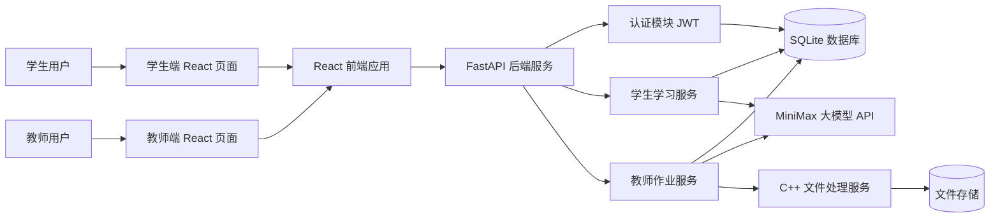
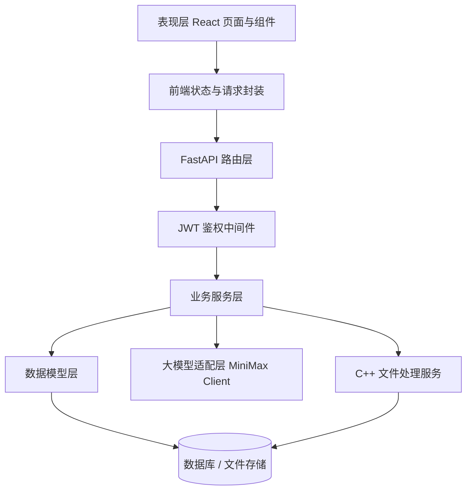
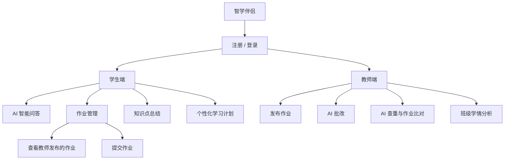
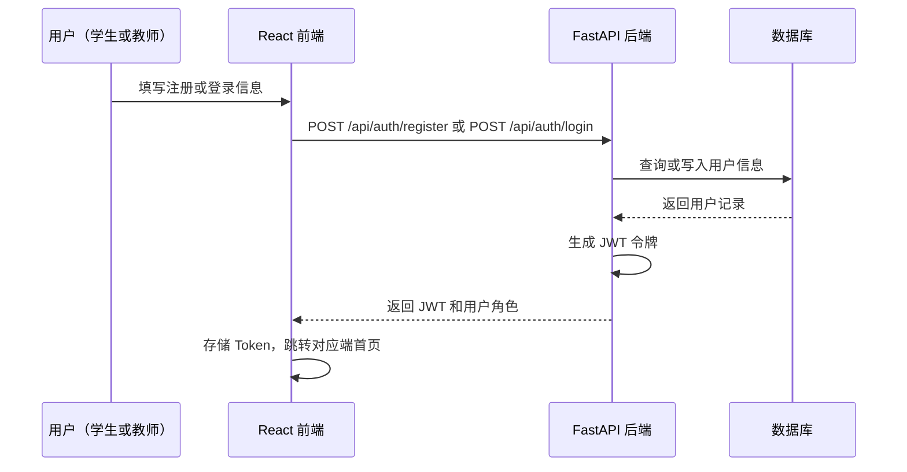
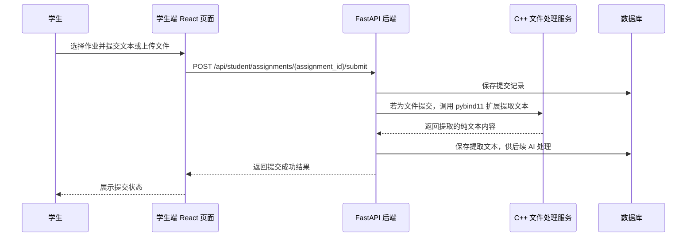
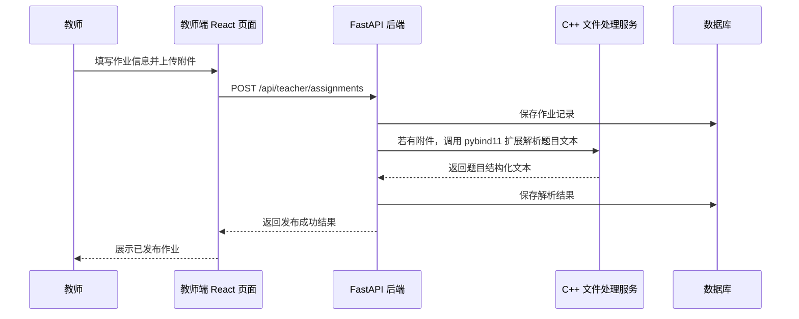
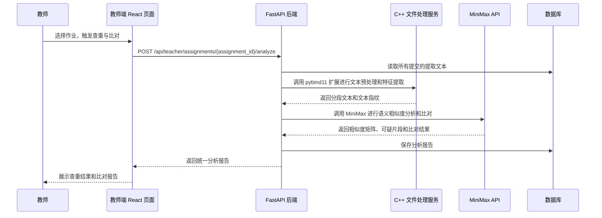

# 智学伴侣架构设计文档

## 1. 项目概述

智学伴侣是一个基于 AI 的校园学习伴侣系统，项目分为学生端和教师端。学生端面向日常学习场景，提供智能问答、作业管理、知识点总结和个性化学习计划；教师端面向作业管理场景，提供发布作业、AI 批改、AI 查重与作业比对能力。项目定位不是传统教学平台，而是突出 AI 在学习陪伴、学情分析和作业辅助处理中的作用。

系统支持学生和教师分角色注册与登录，通过 JWT 令牌区分身份和权限。作业的生命周期由教师发布开始、学生提交截止；AI 查重与作业比对合并为统一的智能分析模块。文件处理（含作业附件的解析、对比预处理）由 C++ 编写的 pybind11 扩展模块完成，后端直接以 Python 模块方式调用。

## 2. 建设目标

- 提供学生和教师的注册与登录能力，支持角色区分和 JWT 鉴权。
- 提供学生端 AI 问答能力，支持课程知识、学习方法、作业要求等问题咨询。
- 提供学生端作业管理能力，学生可查看教师发布的作业并提交作业内容。
- 提供学生端知识点总结能力，帮助学生对课堂笔记和资料进行结构化整理。
- 提供学生端个性化学习计划能力，根据成绩、作业完成情况、错题薄弱点生成定制化学习安排。
- 提供教师端发布作业能力，教师可新建作业、设置要求、截止时间和附件。
- 提供教师端 AI 批改能力，对学生提交给出评分、评语、扣分点和修改建议。
- 提供教师端 AI 查重与比对合并能力，统一识别高度相似内容、参考痕迹和作业差异。
- 提供 C++ 文件处理服务，负责解析作业文件、提取文本、预处理相似度比对数据。
- 后端采用 FastAPI 构建 API 服务，使用 uv 管理 Python 项目依赖。
- 大模型能力接入 MiniMax，用于问答、总结、学习计划生成、作业批改和语义相似度分析。

## 3. 技术选型

- 前端：React、TypeScript、Vite、React Router、Axios 或 Fetch API。
- 后端：Python、FastAPI、uv、Pydantic、Uvicorn。
- 文件处理模块：C++，通过 pybind11 编译为 Python 扩展（`.so`），由后端直接导入调用，负责作业文件解析、文本提取和相似度预处理。
- 大模型：MiniMax API。
- 数据存储：SQLite 作为课程设计阶段的轻量数据库，后续可替换为 PostgreSQL 或 MySQL。
- 鉴权方案：JWT（JSON Web Token），支持学生和教师角色区分。
- 部署方式：前端静态资源部署，后端独立运行 API 服务，C++ pybind11 扩展随后端一同编译部署。

## 4. 总体架构



## 5. 分层架构



## 6. 功能模块设计

### 6.1 端侧划分

系统按照使用角色分为学生端和教师端，两端均需先完成注册和登录。学生端强调 AI 学习陪伴，教师端强调 AI 辅助处理作业和提升教学管理效率。



### 6.2 认证模块（注册 / 登录）

认证模块支持学生和教师的账号注册与登录，返回 JWT 令牌供后续接口鉴权。后端通过中间件验证令牌并注入当前用户角色。

主要能力：

- 学生注册：填写学号、姓名、班级和密码。
- 教师注册：填写工号、姓名、所教课程和密码。
- 统一登录：邮箱/学号/工号 + 密码，返回 JWT 和用户角色。
- JWT 过期自动刷新或重新登录。

处理流程：



### 6.3 学生端作业管理模块

作业管理模块替代原作业提醒模块。学生可以查看教师发布的全部作业，并针对指定作业提交内容（文本或文件）。提交状态由"未提交"变更为"已提交"。

主要能力：

- 查看教师发布的作业列表，含课程、要求、截止时间和附件。
- 查看作业详情。
- 提交作业（文本内容或文件上传）。
- 查看本人提交状态（未提交 / 已提交）。

处理流程：



### 6.4 教师端发布作业模块

教师可以新建作业任务，设置作业标题、所属课程、要求说明、参考答案、评分标准、截止时间，并可上传附件（如题目 PDF）。发布后学生端可见。

主要能力：

- 新建作业（标题、课程、要求、截止时间、参考答案、评分标准）。
- 上传作业附件（PDF、Word、图片等），由 C++ 服务完成解析。
- 查看已发布作业列表及每份作业的提交统计。
- 编辑或关闭作业。

处理流程：



### 6.5 教师端 AI 查重与作业比对模块（合并）

AI 查重与作业比对合并为同一模块，通过统一入口对一批提交进行处理。系统先由 C++ 文件处理服务完成文本提取和预处理（分段、去噪、特征提取），再调用 MiniMax 进行语义相似度分析，最终输出可疑对列表、相似片段和作业差异报告。

主要能力：

- 对一批提交同时执行查重检测和多维度比对。
- C++ 预处理阶段：分段切割、去除无效字符、提取文本指纹。
- AI 阶段：语义相似度计算、可疑片段标注、观点与结构差异分析。
- 输出统一报告：可疑对（含相似度和风险等级）+ 比对维度差异。

处理流程：



### 6.6 学生端智能问答模块

智能问答模块用于接收学生提出的问题，并调用 MiniMax 大模型生成回答。系统可以记录问答历史，方便用户回顾。

主要能力：

- 支持自然语言提问。
- 支持指定课程或知识领域。
- 支持返回简洁回答、详细解释和学习建议。
- 支持保存历史会话。

### 6.7 学生端知识点总结模块

知识点总结模块用于将用户输入的课堂笔记、教材片段或主题内容整理为结构化摘要。

主要能力：

- 生成知识点概要。
- 提炼重点、难点和易错点。
- 生成复习清单。
- 可选生成练习建议。

### 6.8 学生端个性化学习计划模块

个性化学习计划模块根据学生的成绩、作业完成情况、错题记录和学习目标，调用 MiniMax 生成定制化学习安排。

主要能力：

- 分析学生近期成绩、作业得分、逾期情况和薄弱知识点。
- 生成按天或按周安排的学习计划。
- 推荐复习重点、练习方向和时间分配。

### 6.9 教师端 AI 批改模块

教师端 AI 批改模块用于辅助教师批量处理学生作业。

主要能力：

- 根据参考答案和评分标准生成分数、评语、扣分点和修改建议。
- 批改结果作为 AI 建议，教师可确认或手动调整。
- 汇总批改报告，提供班级常见错误和薄弱知识点。

## 7. C++ 文件处理模块设计

C++ 文件处理模块通过 **pybind11** 编译为 Python 扩展（`file_processor.so`），由 FastAPI 后端直接 `import` 使用，无进程启动开销，参数与返回值以 Python 原生类型传递。详细的函数接口规范见 [cpp_api.md](cpp_api.md)。

### 7.1 应用场景

| 场景 | 说明 |
| --- | --- |
| 作业文件文本提取 | 解析学生上传的 PDF、TXT、Word（转换后）等格式，提取纯文本供 AI 处理 |
| 教师题目附件解析 | 解析教师上传的题目文件，提取结构化题目文本 |
| 文本预处理与分段 | 去除特殊字符、空白行；按段落或句子切分；为查重提供统一格式的文本片段 |
| 文本指纹提取 | 基于滑动窗口的哈希指纹（Rabin-Karp 或 SimHash 思路），快速过滤明显不相似的提交对 |
| 批量文本对比预处理 | 对多份作业文本进行两两相似度粗筛（基于指纹），减少需要送入 MiniMax 的提交对数量 |
| 日志文件写入 | 将文件处理过程的错误信息写入结构化日志文件，供后端调试 |

### 7.2 目录建议

```text
cpp_processor/
  setup.py               // pybind11 编译入口
  CMakeLists.txt
  src/
    bindings.cpp         // pybind11 绑定层，暴露 Python 接口
    extractor.cpp        // 文件文本提取（TXT、PDF 适配层）
    preprocessor.cpp     // 文本预处理与分段
    fingerprint.cpp      // 文本指纹计算
    comparator.cpp       // 批量相似度粗筛
    logger.cpp           // 日志写入工具
  include/
    extractor.h
    preprocessor.h
    fingerprint.h
    comparator.h
    logger.h
  tests/
    test_extractor.cpp
    test_fingerprint.cpp
```

## 8. 后端目录建议

```text
backend/
  pyproject.toml
  uv.lock
  app/
    main.py
    core/
      config.py
      security.py        // JWT 工具函数
    api/
      routes_auth.py             // 注册 / 登录
      routes_chat.py
      routes_student_assignments.py   // 学生查看 / 提交作业
      routes_summary.py
      routes_learning_plans.py
      routes_teacher_assignments.py   // 教师发布 / 管理作业
    services/
      auth_service.py
      chat_service.py
      student_assignment_service.py
      summary_service.py
      learning_plan_service.py
      grading_service.py
      analyze_service.py        // 查重与比对合并服务
      file_processor_client.py  // 调用 C++ 文件处理服务
      minimax_client.py
    models/
      user.py
      chat.py
      assignment.py
      submission.py
      grade.py
      learning_plan.py
    schemas/
      auth.py
      chat.py
      student_assignment.py
      summary.py
      learning_plan.py
      teacher_assignment.py
    db/
      session.py
      init_db.py
```

## 9. 前端目录建议

```text
frontend/
  package.json
  vite.config.ts
  src/
    main.tsx
    App.tsx
    api/
      client.ts
      auth.ts
      chat.ts
      studentAssignments.ts
      summary.ts
      teacherAssignments.ts
    pages/
      LoginPage.tsx
      RegisterPage.tsx
      StudentChatPage.tsx
      StudentAssignmentPage.tsx      // 查看作业列表 + 提交作业
      StudentSummaryPage.tsx
      StudentLearningPlanPage.tsx
      TeacherAssignmentPage.tsx      // 发布 + 管理作业
      TeacherGradingPage.tsx
      TeacherAnalyzePage.tsx         // 查重与比对合并页面
    components/
      Layout.tsx
      StudentLayout.tsx
      TeacherLayout.tsx
      AuthGuard.tsx                  // 路由鉴权组件
      ChatBox.tsx
      AssignmentCard.tsx
      SubmitAssignmentForm.tsx
      SummaryPanel.tsx
      LearningPlanPanel.tsx
      GradingReport.tsx
      AnalysisReport.tsx             // 查重与比对合并报告
    styles/
      global.css
```

## 10. 数据模型设计

### 10.1 用户 User

| 字段 | 类型 | 说明 |
| --- | --- | --- |
| id | string | 用户 ID |
| username | string | 登录用户名（学号或工号） |
| name | string | 真实姓名 |
| role | string | student 或 teacher |
| password_hash | string | 密码哈希 |
| extra | json | 扩展信息（学生：班级；教师：所教课程） |
| created_at | datetime | 注册时间 |

### 10.2 作业 Assignment

| 字段 | 类型 | 说明 |
| --- | --- | --- |
| id | string | 作业 ID |
| teacher_id | string | 发布教师 ID |
| title | string | 作业标题 |
| course | string | 所属课程 |
| description | string | 作业要求说明 |
| reference_answer | string | 参考答案（可选） |
| rubric | string | 评分标准（可选） |
| attachment_path | string | 附件存储路径（可选） |
| attachment_text | string | C++ 服务解析的附件文本（可选） |
| due_at | datetime | 截止时间 |
| status | string | open（进行中）、closed（已关闭） |
| created_at | datetime | 创建时间 |
| updated_at | datetime | 更新时间 |

### 10.3 作业提交 Submission

| 字段 | 类型 | 说明 |
| --- | --- | --- |
| id | string | 提交 ID |
| assignment_id | string | 作业 ID |
| student_id | string | 学生 ID |
| content | string | 作业正文（文本提交） |
| file_path | string | 文件路径（文件提交） |
| extracted_text | string | C++ 服务提取的文本（文件提交时填充） |
| submitted_at | datetime | 提交时间 |
| status | string | submitted（已提交） |

### 10.4 AI 批改结果 AIGradingResult

| 字段 | 类型 | 说明 |
| --- | --- | --- |
| id | string | 批改结果 ID |
| submission_id | string | 提交 ID |
| score | number | AI 建议分数 |
| comments | string | 总体评语 |
| deductions | json | 扣分点列表 |
| suggestions | json | 修改建议列表 |
| confirmed | boolean | 教师是否已确认 |
| final_score | number | 教师最终分数（可覆盖 AI 分数） |
| created_at | datetime | 创建时间 |

### 10.5 查重与比对报告 AnalysisReport

| 字段 | 类型 | 说明 |
| --- | --- | --- |
| id | string | 报告 ID |
| assignment_id | string | 作业 ID |
| suspicious_pairs | json | 可疑提交对列表（含相似度和风险等级） |
| comparison_details | json | 多维度比对详情 |
| fingerprint_data | json | C++ 生成的文本指纹数据（供调试） |
| created_at | datetime | 创建时间 |

### 10.6 问答消息 ChatMessage

| 字段 | 类型 | 说明 |
| --- | --- | --- |
| id | string | 消息 ID |
| user_id | string | 用户 ID |
| session_id | string | 会话 ID |
| role | string | user 或 assistant |
| content | string | 消息内容 |
| course | string | 可选课程标签 |
| created_at | datetime | 创建时间 |

### 10.7 知识总结 Summary

| 字段 | 类型 | 说明 |
| --- | --- | --- |
| id | string | 总结 ID |
| user_id | string | 用户 ID |
| title | string | 总结标题 |
| source_text | string | 原始文本 |
| result | json | 结构化总结结果 |
| created_at | datetime | 创建时间 |

### 10.8 学习计划 LearningPlan

| 字段 | 类型 | 说明 |
| --- | --- | --- |
| id | string | 学习计划 ID |
| student_id | string | 学生 ID |
| course | string | 课程名称 |
| basis | json | 生成依据，包含成绩、作业、错题和目标 |
| plan | json | AI 生成的学习计划 |
| status | string | active、completed 或 archived |
| created_at | datetime | 创建时间 |

## 11. MiniMax 接入设计

后端单独封装 `minimax_client.py`，避免业务代码直接依赖外部 API 细节。

环境变量建议：

```bash
MINIMAX_API_KEY=your_api_key
MINIMAX_GROUP_ID=your_group_id
MINIMAX_MODEL=abab6.5s-chat
```

大模型调用职责：

- 统一构造请求头和鉴权信息。
- 统一处理请求超时、失败重试和错误日志。
- 为智能问答、知识总结、学习计划、AI 批改、查重与比对提供独立方法。
- 对返回结果做基础校验，避免空回答、分数异常或结构化字段缺失。
- 将教师端批改结果标记为 AI 建议，最终分数可由教师确认或调整。

## 12. 安全与异常处理

- API Key 只保存在后端环境变量中，前端不得直接访问 MiniMax API。
- 所有需要登录的接口均须携带 JWT 令牌，未登录返回 401。
- 教师端接口（发布作业、查重、批改）须校验 role == teacher，学生端提交接口须校验 role == student。
- 后端需要限制单次输入长度，避免超长文本导致接口失败或费用过高。
- 对 MiniMax 调用失败的情况返回友好提示。
- 对注册、登录、作业提交和评分标准等接口进行参数校验。
- 文件上传接口限制文件类型（PDF、TXT、DOC）和大小（最大 10 MB）。
- C++ 文件处理服务的调用失败须捕获异常并返回友好错误，不阻断主流程。
- 教师端 AI 批改、查重和比对结果应作为辅助建议，不直接替代教师最终判断。

## 13. 后续扩展方向

- 支持文件上传的更多格式（PPT、图片 OCR），由 C++ 服务扩展适配层。
- 支持课程表导入，自动生成学习提醒。
- 支持多轮对话上下文管理。
- 支持 RAG 知识库，将课程资料向量化后增强问答准确性。
- 支持提醒通知，如浏览器通知、邮件或移动端推送。
- 支持班级维度学情看板，展示学生群体薄弱知识点和作业质量趋势。
- C++ 模块可扩展为独立微服务（gRPC 或 HTTP），替代当前 pybind11 直接调用方式。
