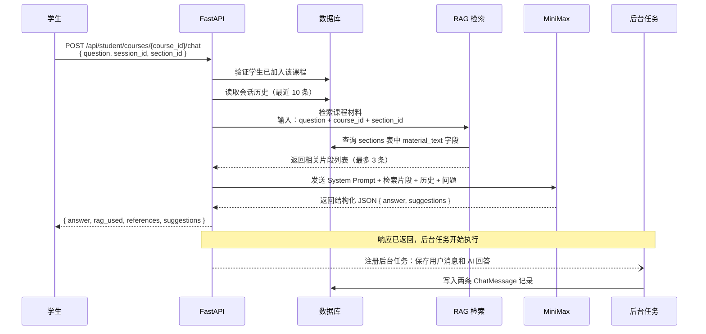
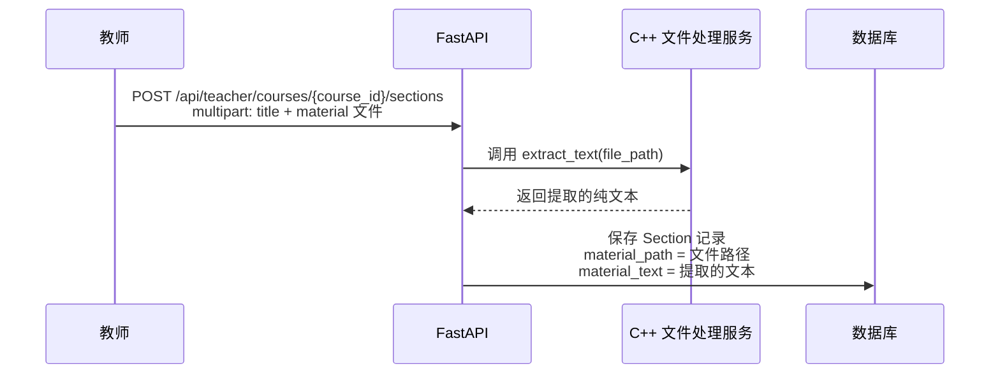
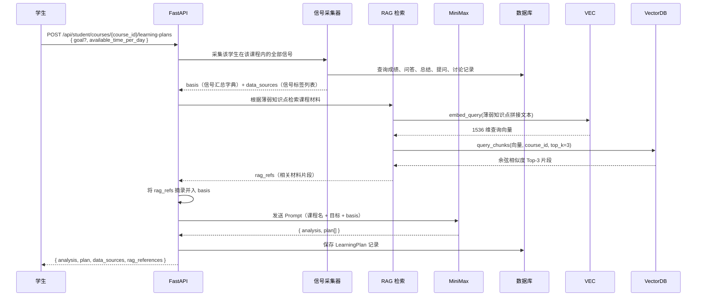
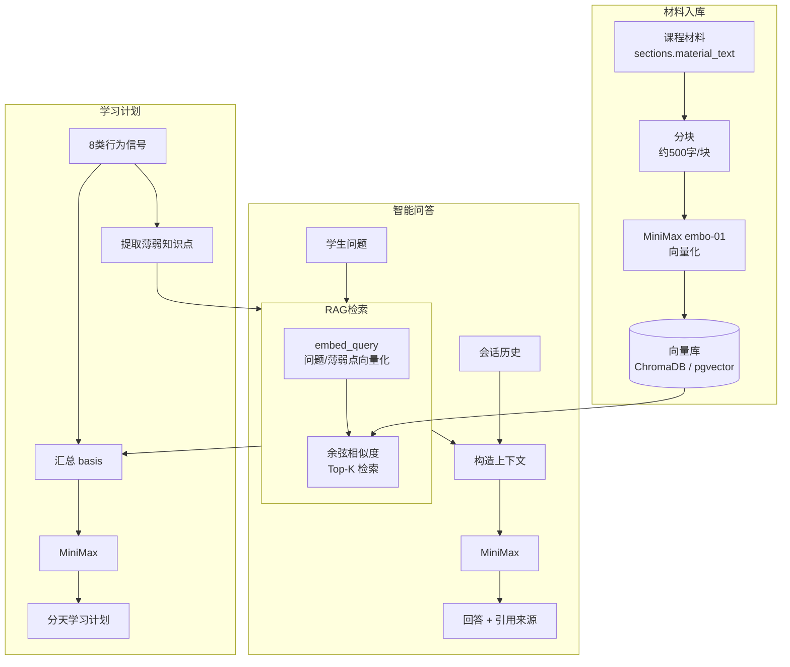

# AI 核心功能设计文档

本文档专注于智学伴侣两个核心 AI 功能的设计与实现：**基于课程材料的智能问答（RAG）** 和 **个性化学习计划生成**。

---

## 1. 功能定位

| 功能 | 核心目标 | 关键特征 |
| --- | --- | --- |
| 智能问答（RAG） | 回答学生在课程学习中遇到的问题，答案基于教师发布的课程材料，而非通用知识 | 课程材料检索 → 增强回答；引用来源可溯 |
| 个性化学习计划 | 根据学生在课程内的真实表现和个人特点，生成具体可执行的学习安排 | 多维信号采集 → RAG 定位材料 → 计划任务与真实章节对齐 |

两个功能共享同一套**课程材料检索**基础设施，并且个性化学习计划会将智能问答、知识总结、提问、讨论等行为数据作为输入信号。

---

## 2. 智能问答（RAG）

### 2.1 为什么需要 RAG

不带任何上下文直接调用大模型，得到的是通用教材级别的回答，与学生正在学习的课程内容脱节。例如，同样的问题"进程调度算法有哪些"，通用回答会列举大量算法，但教师可能只要求掌握其中三种，且有特定的讲解顺序和侧重点。

RAG（Retrieval-Augmented Generation，检索增强生成）的作用是：在向大模型提问之前，先从教师上传的课程材料中找到与问题最相关的段落，将这些段落连同问题一起发送给大模型，让模型基于课程实际内容作答。

### 2.2 整体流程

消息写入数据库通过后台任务异步执行，不阻塞响应返回（详见 2.5 节）。



### 2.3 材料入库流程

RAG 能检索到内容的前提是教师上传的课件已被提取为文本并存入数据库。材料入库发生在教师创建小节并上传文件时：



`material_text` 是 RAG 检索的数据源，存储在 `sections` 表中，与小节一一对应。

### 2.4 Prompt 构造

```
System Prompt:
  你是一个专业的学习助手。当前课程：{课程名}。

  以下是与问题相关的课程材料，请优先基于这些内容作答：
  [课程材料参考] {小节标题}：{材料片段}
  [课程材料参考] {小节标题}：{材料片段}
  ...

  请用简洁、准确的语言回答学生的问题，并给出 2-3 条学习建议。
  以 JSON 格式返回：{"answer": "...", "suggestions": ["...", "..."]}

User:
  （最近 3 轮对话历史）
  学生问题：{question}
```

无检索结果时（`rag_used = false`），省略课程材料部分，退化为通用知识问答。

### 2.5 消息写入的异步化

**问题**：智能问答的关键路径是 `权限验证 → 读历史 → RAG 检索 → 调用 MiniMax`，其中 MiniMax 调用是耗时最长的步骤（通常 1～3 秒）。如果在 MiniMax 返回之后、响应发出之前再同步写数据库，会额外增加几十毫秒不必要的等待。

**方案**：使用 FastAPI 内置的 `BackgroundTasks`，在响应发出后由框架调度写入操作，主流程完全不等待数据库。

```
同步方案（改造前）：
  RAG → MiniMax → 写 DB → 返回响应
                  ←—等—→

异步方案（改造后）：
  RAG → MiniMax → 返回响应
                       ↓（响应已发出）
                  后台任务写 DB
```

**实现要点**：

`send_message` 不再写数据库，将写入所需的数据（问题、回答、用户 ID 等）打包进返回值的 `_save_ctx` 字段，由路由层取出后注册后台任务：

```python
# routes_chat.py
result = svc.send_message(...)
save_ctx = result.pop("_save_ctx")           # 取出写入上下文，同时从响应里移除
background_tasks.add_task(svc.save_messages, result["session_id"], save_ctx)
return _ok(result)                           # 立即返回，不等写入完成
```

`save_messages` 使用**独立的 DB session**，而非复用请求的 session。请求的 session 在响应发出后会被 FastAPI 关闭，后台任务若继续使用它会报错：

```python
# chat_service.py
def save_messages(session_id: str, ctx: dict) -> None:
    from app.db.session import SessionLocal
    db = SessionLocal()          # 独立 session，不依赖请求生命周期
    try:
        db.add(ChatMessage(...)) # 保存用户问题
        db.add(ChatMessage(...)) # 保存 AI 回答
        db.commit()
    except Exception:
        db.rollback()
        logger.exception("后台保存消息失败，session_id=%s", session_id)
    finally:
        db.close()
```

**失败处理**：写入失败只影响历史记录，不影响本次回答。失败时记录错误日志，不向用户抛出异常。对于对话历史一致性要求较高的场景，可在失败时加入重试队列（如 Celery）。

### 2.6 RAG 实现方案

RAG 检索基于 **MiniMax Embedding API**（模型 `embo-01`，1536 维）+ **ChromaDB** 嵌入式向量数据库实现，支持无缝切换至 PostgreSQL + pgvector，切换时业务代码零修改。

**材料入库（写入路径）**

教师上传课件后，系统自动完成以下步骤：

1. C++ 文件处理服务提取纯文本，存入 `sections.material_text`
2. 计算文本 SHA-256 hash，与数据库存储的 `material_hash` 比对：内容相同则跳过后续步骤（**增量更新**）；内容变化则先删除旧块
3. 对文本做**段落/标题感知分块**：先按 Markdown 标题行（`# 开头`）和连续空行（`\n\n`）切分为自然语义段落；超长段落（> 500 字）再降级为字符分块，相邻块保留 50 字重叠
4. 批量调用 MiniMax `embo-01` 模型向量化所有块
5. 将向量和元数据（`section_id`、`section_title`、`course_id`、片段原文）写入向量库，并将新 hash 写回 `sections.material_hash`

**查询路径（检索）**

| 环节 | 实现 |
| --- | --- |
| 查询向量化 | 调用 MiniMax `embo-01` 对学生问题/薄弱知识点向量化 |
| 初召回（粗筛） | 向量库召回 `max(top_k × 4, 10)` 个候选块，按 `course_id` 过滤 |
| 精排（Rerank） | Python 侧对每个候选块重新计算精确余弦相似度，降序排列取 Top-K |
| 结果 | 返回最相关的 K 个文本块，附带 `section_title`、`file_name`、`score` |

**数据库选择逻辑**

配置项 `VECTOR_DB_URL` 控制向量库选择，两条链路共存：

```
VECTOR_DB_URL 未设置（默认）
  → ChromaDB 嵌入式，持久化到 backend/chroma_db/
  → 零额外依赖，开箱即用

VECTOR_DB_URL = postgresql+psycopg2://...
  → pgvector，在同一个 PostgreSQL 实例中创建 course_material_chunks 表
  → 与关系数据库统一运维，适合生产部署
```

向量库的统一接口在 `app/db/vector_store.py` 中，对外只暴露 `upsert_chunks`、`query_chunks`（内含两阶段 Rerank）、`delete_chunks_by_section` 三个函数，上层服务无感知切换。

**降级策略**

Embedding API 或向量库不可用时（如 API Key 未配置、向量库连接失败），`_rag_retrieve` 会静默捕获异常，返回空列表，系统退化为无上下文的通用知识问答，不中断主流程。

### 2.7 知识点总结中的 RAG

知识点总结功能复用同一套材料检索逻辑，支持两种模式：

| 模式 | 触发条件 | 内容来源 |
| --- | --- | --- |
| 自由输入 | 请求体包含 `source_text` | 学生手动粘贴的笔记或文本 |
| 课程材料 | 请求体仅含 `section_id` | 从该小节的 `material_text` 中取前 3000 字 |

课程材料模式下，学生不需要复制粘贴，直接对某一章节生成总结，总结内容与课程实际内容强绑定。

---

## 3. 个性化学习计划

### 3.1 设计思路

学习计划的质量取决于输入信号的丰富程度。单纯依靠成绩只能告诉系统"哪里分低"，但无法知道"是因为不理解概念、还是不会应用、还是做题不够多"。通过采集学生在平台上的多种行为，可以从不同维度还原学生的真实学习状态。

### 3.2 数据信号

系统在生成计划时自动从数据库采集以下 7 类信号，无需学生手动填写：

| 信号 | 数据表 | 采集内容 | 作用 |
| --- | --- | --- | --- |
| 成绩数据 | `ai_grading_results` + `assignments` | 各作业得分、满分、扣分点 | 定位薄弱知识点 |
| 测试成绩 | `quiz_attempts` + `quiz_answers` | 各测试得分、客观题错题内容 | 从错题直接提取具体薄弱知识点 |
| 个人信息 | `users.extra` | `interests`（兴趣）、`career_direction`（岗位方向） | 调整计划侧重与举例方向 |
| AI 问答记录 | `chat_messages` | 最近 10 条学生问题 | 识别反复困惑的概念 |
| 知识点总结 | `summaries` | 已生成总结的小节标题 | 判断主动复习覆盖情况 |
| 提问记录 | `questions` | 向教师提问的问题标题 | 精确定位认知卡点 |
| 讨论参与 | `discussion_replies` + `discussions` | 参与讨论的话题标题 | 判断学习投入度 |
| 课程材料（RAG） | `sections.material_text` + 向量库 | 与薄弱知识点相关的材料片段（段落感知分块 + 两阶段 Rerank 精排） | 确保计划任务与课程内容对齐 |

### 3.3 整体流程



### 3.4 Prompt 构造

```
System Prompt:
  你是一个专业的学习规划助手。根据学生的成绩、作业完成情况和学习目标，
  生成一份按天安排的学习计划。
  以 JSON 格式返回，包含字段：
    analysis（包含 current_level、weak_points、priority）
    plan（每天任务列表，每项含 day、task、duration_minutes）

User:
  课程：{课程名}
  学习目标：{goal}
  每天可用时间：{N} 分钟
  学情数据：{
    "profile": { "career_direction": "backend", "interests": ["算法"] },
    "grade_records": [
      { "title": "进程管理练习", "score": 68, "full_score": 100,
        "weak_points": ["进程状态转换", "调度算法对比"] }
    ],
    "recent_questions": ["阻塞态和挂起态有什么区别？", "LRU 为什么比 FIFO 命中率高？"],
    "questions_asked": ["进程的阻塞态和挂起态有什么区别？"],
    "discussions_participated": ["关于进程调度算法，哪种最适合交互式系统？"],
    "course_material_excerpts": ["进程的五种状态及转换条件如下..."]
  }
```

大模型接收到以上信息后，能够：
- 识别学生对"进程状态转换"和"调度算法"的困惑（来自成绩扣分点 + 提问记录）
- 知道学生是后端方向（来自个人信息），生成计划时强调并发相关应用场景
- 引用课程材料中的实际章节（来自 RAG 片段），让计划任务不是泛泛的"复习第一章"，而是"精读课件第 12 页进程状态转换图"

### 3.5 响应结构

```json
{
  "analysis": {
    "current_level": "基础概念掌握一般，进程调度部分偏弱",
    "weak_points": ["进程状态转换", "调度算法对比"],
    "career_relevance": "进程调度和并发模型是后端开发的重要基础，建议重点加强",
    "priority": "先补齐状态转换，再横向对比调度算法"
  },
  "data_sources": ["scores", "profile", "chat_sessions", "questions", "course_materials"],
  "rag_references": [
    {
      "section_id": "section_001",
      "section_title": "第一章：进程管理",
      "file_name": "section_001_slides.pdf",
      "excerpt": "进程的五种状态及转换条件如下..."
    }
  ],
  "plan": [
    {
      "day": 1,
      "task": "精读课件第 12-18 页「进程状态转换图」，重点理解阻塞态与挂起态的区别（你曾提问过这个知识点）",
      "duration_minutes": 60,
      "section_id": "section_001",
      "section_title": "第一章：进程管理"
    }
  ]
}
```

`data_sources` 字段向前端透明地展示本次计划基于哪些数据生成，`rag_references` 让用户可以追溯计划推荐的材料来源。

### 3.6 已实现的质量保障

| 方向 | 说明 |
| --- | --- |
| 进度感知调整 | 学生打卡 + 文字反馈 → `POST /adjust` 触发 AI 增量调整，保留已完成任务，只改剩余部分 |
| 效果量化反馈 | `GET /effect` 对比计划前后作业均分变化，输出 `improvement` 系数 |
| 测试成绩信号 | 测试定位为正式考核，错题内容自动作为薄弱知识点，与作业扣分点共同进行 RAG 检索 |

---

## 4. 两个功能的关系



两个功能共享同一套 RAG 检索逻辑（`_rag_retrieve` 函数族），均通过向量检索实现，差异仅在于检索 query 的来源：
- **智能问答**：用学生的问题向量化后检索，找到回答问题所需的参考段落
- **学习计划**：将所有薄弱知识点拼接后向量化检索，找到需要重点复习的材料章节

---

## 5. 信号数据的采集时机

各类信号数据在用户正常使用过程中持续积累，不需要额外操作：

| 信号 | 何时写入 |
| --- | --- |
| 成绩数据 | 教师确认 AI 批改结果时（`confirmed = True`） |
| 测试成绩 | 学生提交测试答案时（系统自动批改后） |
| 个人信息 | 学生在个人资料页填写兴趣/岗位方向时 |
| AI 问答记录 | 每次学生发送问题并收到回答后（后台任务异步写入） |
| 知识点总结 | 学生创建一条总结时 |
| 提问记录 | 学生向教师提交问题时 |
| 讨论参与 | 学生在讨论中发表回复时 |
| 课程材料 | 教师上传小节课件时（C++ 服务提取文本 → SHA-256 hash 比对 → 内容变化才向量化写入向量库） |

越晚生成学习计划，积累的信号越丰富，计划质量也越高。对于刚加入课程、尚未有任何记录的新学生，系统会退化到仅依靠个人信息（岗位方向 + 兴趣）生成初版计划。

---

## 6. RAG 精度保障（已实现）

以下三项 RAG 精度优化均已在当前版本实现，无需额外配置即可生效：

| 方向 | 实现说明 |
| --- | --- |
| 重排序（Rerank） | 向量库先召回 `max(top_k × 4, 10)` 个候选块（粗筛），再由 `vector_store._rerank` 在 Python 侧重新计算精确余弦相似度，降序取 Top-K，过滤近似索引误差 |
| 分块策略细化 | `section_service._split_text` 优先按 Markdown 标题行和连续空行切分为自然语义段落；超长段落（> 500 字）才降级为字符分块（保留 50 字重叠），语义边界更准确 |
| 增量更新索引 | `section_service._index_material` 在向量化前计算 `material_text` 的 SHA-256 hash，与 `sections.material_hash` 比对；内容未变则跳过 Embedding API 调用和向量库写入，只有实际变化的小节才重建索引 |

